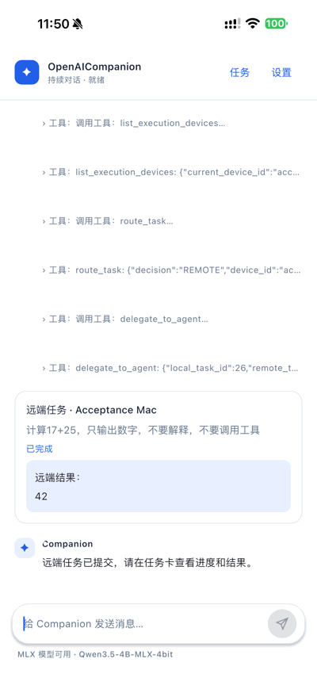

# OpenAICompanion

OpenAICompanion 是一个面向个人设备、以本地数据为中心的 AI 助手实验项目。它使用 Rust Harness 运行 Agent Loop、保存会话轨迹与记忆，并通过 Kotlin Multiplatform（KMP）和 UniFFI 连接应用端。项目仍处于 MVP 开发阶段；架构图中的部分能力尚未实现。

## iOS Demo

<p align="center">
  
</p>

真机验收截图轮播：展示远端任务结果回到 iPhone 对话，以及跨设备配置说明。截图经过裁剪遮挡，不展示验收服务地址；轮播间隔不代表推理速度。iOS 支持本地 GGUF / MLX 推理、思考与正文流式显示、Markdown 和明确委托后的跨设备执行。

[使用 iOS](#ios) · [使用 macOS](#macos) · [使用 Android](#android) · [配置可选功能](#可选功能配置)

## 当前状态

| 平台 | 实现 | 状态 |
| --- | --- | --- |
| macOS | Compose Desktop（KMP/JVM）+ Rust Harness | MVP 已实现，可在 macOS 本机构建运行 |
| iOS | KMP + Compose Multiplatform + Kotlin/Native Rust 绑定 + llama.cpp / MLX | KMP 界面，原生模型桥接；验收范围及待验收项见 iOS MVP 指南 |
| Android | KMP + Compose Multiplatform + Rust UniFFI + llama.cpp JNI | Debug APK 已构建；Android 35 ARM64 模拟器已验证安装、首屏启动与本地存储初始化 |

各设备分别维护一条本地持续对话，不提供新建会话入口，也不会自动同步聊天记录。Rust Harness 管理对话轨迹和中长期记忆；中长期记忆可另行配置 HTTPS 同步。iOS 已完成指定真机上的本地问答、流式输出、停止、跨设备结果回流、模型库下载与导入，以及一次性系统提醒等场景验收；这不代表所有机型、模型或完整生产验收通过。详见各平台指南。

## 生产基础进展

已接入统一 ASGI 服务、HTTPS 容器部署配置、可撤销凭据与一次性配对、提交回执恢复、版本迁移、离线备份/导出/删除及 CI。Mac 提供常驻自动接单 worker；手机固定提醒交给系统排程。端侧工具默认关闭，作为可选扩展开启。部署、数据维护和执行边界见[跨设备执行指南](docs/cross_device_execution.md)与[主动任务指南](docs/proactive.md)。

目前仍不能作为完成生产验收的版本：当前 Android 版本构建和真机后台验收、正式签名发布、生产部署/恢复演练、全链路磁盘与备份加密、App 内数据管理、真实模型质量评测、容量/保留策略和运维告警尚待完成。手机退出后的实时条件推理与远程结果推送也未接入；系统计划提醒不包含实时判断。2026-10-07 已进一步完成 Mac 打包 worker 实际接单回传、三库恢复及 iOS 模拟器 UI/退出后系统提醒验收；逐项结果和仍未验收的边界见[本机验收记录](docs/cross_device_execution.md#2026-10-07-本机验收记录)。

## 快速开始

### macOS

需要 macOS、JDK 21、Rust 工具链，以及一个 OpenAI 兼容的 Chat Completions 模型服务。首次构建还需要下载 Gradle、Kotlin 和 Rust 依赖。从仓库根目录运行：

```bash
./scripts/macos-app.sh run
```

应用默认使用本机 Ollama 地址 `http://localhost:11434/v1/chat/completions`，模型名为 `hf.co/unsloth/Qwen3.8-27B-GGUF:UD-Q4_K_M`。模型需自行安装，也可在应用设置中改用其他兼容服务。打包 DMG：

```bash
./scripts/macos-app.sh package
```

安装后的使用步骤：

1. 打开“设置与模型”，填写完整的 Chat Completions 地址、服务实际提供的模型名称和可选 API Key；API Key 仅保存在本次运行内存中。默认模型并未随 App 安装，请根据机器内存选择可运行的模型。
2. 使用本机 Ollama 时，先启动 Ollama 并保存本机连接，再在模型库搜索、下载模型，下载完成后点击“使用此模型”。自定义远端模型接口不执行本机下载。
3. 回到对话输入问题，点击发送或按 `⌘↵`；`⌘,` 打开设置，生成期间可停止。
4. 跨设备入口在“跨设备执行与远端任务”；提醒与记忆同步入口在“管理主动任务”。这些均为可选功能，本地聊天无需部署设备服务。

安装模型、运行参数和数据目录详见 [macOS MVP 指南](docs/macos_mvp.md)。

### iOS

需要完整 Xcode（含 iOS SDK 与 Metal Toolchain）、JDK 21 和 Rust iOS 目标。当前 Xcode target 使用 Objective-C 启动壳、KMP + Compose Multiplatform 界面，MLX 通过薄 Swift 桥接调用官方库：

```bash
rustup target add aarch64-apple-ios aarch64-apple-ios-sim
./scripts/ios-llama.sh
open ios/OpenAICompanion.xcodeproj
```

在 Xcode 中选择 `OpenAICompanion` target，在 Signing & Capabilities 选择自己的开发团队，再选择已连接的 iPhone，运行安装。真机需开启开发者模式，按系统提示信任自己的开发者 App。工程不附带可直接安装的正式发布包。

安装完整 Xcode 后，可运行 `./scripts/ios-app-check.sh` 构建 iOS 模拟器 App，检查 KMP、Rust、llama.cpp 与 Xcode 工程的链接。

安装后的使用步骤：

1. 进入“设置 → 端侧模型”，选择 `MLX` 或 `llama.cpp`。App 不内置模型，也不需要连接 Mac 的 Ollama。
2. 在对应引擎的模型库搜索适合设备的模型，点击“下载”；下载完成后点击“使用此模型”启用。列表按设备兼容性估算过滤，浏览列表不会下载权重。下载时保持 App 前台。
3. 也可导入本地文件：llama.cpp 选择 GGUF；MLX 选择包含配置、tokenizer 和 safetensors 权重的完整文件夹，导入成功后点击“使用此模型”。
4. 返回对话，输入问题并点击纸飞机或使用键盘发送；生成期间显示思考动画和流式输出，可点击停止。思考与工具历史默认折叠，点击展开。当前只支持文本输入。
5. 需要协作时进入“设置 → 跨设备执行”，点击“配置说明”查看详细步骤；第三方 A2A 入口位于其高级设置中。

需要 iOS 17+；实际模型选择还受架构、内存和空间限制。构建 llama.cpp 需要 CMake 3.28+。模型兼容性见[模型库指南](docs/model-library-and-devices.md)，完整构建与验收范围见 [iOS MVP 指南](docs/ios_mvp.md)。

### Android

需要 JDK 21、Android SDK Platform / Build Tools 35、NDK 27.2.12479018、CMake 3.22.1，以及 Rust Android 目标；设置 `ANDROID_HOME` 并接受 SDK 许可。从仓库根目录执行：

```bash
rustup target add aarch64-linux-android x86_64-linux-android
./scripts/android-llama.sh
cd kmp
./gradlew -PkmpJvmToolchain=21 :androidApp:assembleDebug
adb install -r androidApp/build/outputs/apk/debug/androidApp-debug.apk
```

安装后的使用步骤：

1. 打开“设置 → 端侧模型”，使用 llama.cpp 模型库下载适配的 GGUF，下载完成后点击“使用此模型”；也可从系统文件选择器导入本地 GGUF。Android 当前不支持 MLX。
2. 回到对话输入问题，使用纸飞机或键盘发送，生成期间可以停止。对话、Markdown、工具记录及设置分组复用移动端共享 UI。
3. 按需配置跨设备执行或 MCP；接收跨设备任务时保持 App 前台。
4. 使用主动提醒时允许系统通知；需要更精确的固定提醒，可从主动任务页进入系统精确提醒授权。

最低 Android API 26。历史 Debug APK 与 Android 35 ARM64 模拟器启动烟测已完成；最新共享界面、模型下载与推理、通知、OAuth 及跨设备行为仍需 Android 构建和真机验收。完整要求见 [Android MVP 指南](docs/android_mvp.md)。

## 可选功能配置

先完成本地聊天，再按需要启用以下功能。各设备分别保存自己的设置。

| 功能 | 配置内容与入口 | 使用边界 |
| --- | --- | --- |
| 跨设备执行 | 设备服务根地址、设备名称、独立设备令牌或一次性配对码；三端跨设备页均有“配置说明” | 需要自行部署 HTTPS 服务；普通问答本地回答，当前明确委托才开放远端执行。接单需单独开启；手机持续接单要求前台，Mac 可另行配置 worker。 |
| 第三方 A2A | 移动端跨设备高级设置中填写提供方的 Agent Card 地址及所需 Bearer 令牌 | 同一设备服务下的设备自动发现，无需重复添加；桌面当前未提供独立第三方 Agent 配置入口。 |
| MCP 工具 | MCP 服务地址；移动端受保护服务可按提示进行 OAuth 授权 | 远程地址需 HTTPS；工具调用仍逐次审批。Mac 当前未提供 MCP OAuth 授权入口。 |
| 主动任务与提醒 | 主动任务页开启总开关、选择发现间隔、允许系统通知，并管理生成的任务 | 固定计划可交给手机系统提醒；模型发现和实时查询仍需要可运行的执行端。远程 APNs 未接入。 |
| 历史与记忆 | 移动端“设置 → 历史与记忆”；Mac 设置中的“清空历史与记忆” | 短期清空聊天与原始轨迹；中期清空摘要与阶段性事项；长期清空已提取事实与偏好。三档独立、删除前确认，中长期记忆点删除可随同步传播。详见[三档区别](docs/memory.md#清空历史与记忆)。 |
| 记忆同步 | 同步接口完整地址（如 `https://tasks.example.com/v1/memories/sync`）及有 `memory` 权限的凭据 | 与设备配对分别配置；仅同步中长期记忆点，不同步聊天、任务、模型或工具凭据。 |
| 端侧工具扩展 | 设置中开启设备上下文与日历扩展 | 默认关闭；仍受平台实现、系统权限及逐次确认限制。 |

模型接口、MCP 地址、设备服务根地址、记忆同步接口和 Agent Card 地址用途不同，不能混填。设备服务的生产部署及凭据签发见[跨设备指南](docs/cross_device_execution.md)；记忆同步机制见[记忆同步指南](docs/memory_sync.md)。

## 架构

- `harness/`：Rust Agent Loop、模型与工具回调接口、SQLite 记忆及会话轨迹。
- `kmp/`：跨平台数据模型、Compose 界面、共享 MCP/A2A 客户端、Android/macOS UniFFI JVM 绑定，以及 iOS Kotlin/Native Rust 绑定。
- `ios/`：Objective-C 启动壳、Objective-C++ llama.cpp 适配与 Swift MLX 桥接；界面和业务逻辑位于 `kmp/`。
- `scripts/`：绑定生成及平台构建脚本。


上图描述产品愿景，不代表所有模块已在当前 MVP 中实现。已落地能力以代码和各平台指南为准。

## 测试

Rust Harness：

```bash
cargo test --manifest-path harness/Cargo.toml
```

KMP/JVM 桥接测试需要先构建 Rust 动态库：

```bash
cargo build --manifest-path harness/Cargo.toml --release
cd kmp
HARNESS_LIBRARY_PATH="$PWD/../harness/target/release/libharness.dylib" \
  ./gradlew -PkmpJvmToolchain=21 jvmTest
```

iOS 的 KMP 核心代码可在 `kmp/` 下用 `./gradlew -PkmpJvmToolchain=21 :compileKotlinIosSimulatorArm64` 单独编译；这不等同于 Rust 绑定 C interop、iOS App 的链接或运行验收。
工具调用历史到 GGUF 提示词的本地转换测试可运行 `./scripts/test-ios-prompt.sh`。
用于 iOS 模拟器手动验收的本机 MCP 服务及步骤见 [iOS MVP 指南](docs/ios_mvp.md)。

## 数据与安全

会话轨迹和记忆保存在应用本地 SQLite 中，目前**没有数据库加密**。macOS 模型请求会发送到设置的服务地址；iOS 的 GGUF / MLX 推理在设备本机进行。三端各自保存本地数据，尚无跨设备会话同步。不要将未认证的 Ollama HTTP 服务直接暴露到公网。处理敏感个人数据前，请先评估存储加密、模型服务权限与网络配置。

## 文档

- [模型库与跨设备使用](docs/model-library-and-devices.md)
- [A2A 协议与限制](docs/a2a.md)
- [Agent Loop 设计](docs/agent_loop_core.md)
- [三层记忆实现](docs/memory.md)
- [通用主动任务与通知](docs/proactive.md)
- [本地会话轨迹](docs/session_trace.md)
- [macOS MVP](docs/macos_mvp.md)
- [iOS MVP](docs/ios_mvp.md)
- [Android MVP](docs/android_mvp.md)
- [跨端记忆同步](docs/memory_sync.md)
- [跨设备任务路由与 A2A 执行](docs/cross_device_execution.md)
- [统一端侧工具：设备上下文、日程查询与新建](docs/device_calendar_tool.md)

## 反馈与贡献

构建或使用时遇到问题，可在仓库 Issue 中提供操作系统、Xcode/JDK/Rust 版本、复现步骤和相关日志。欢迎围绕各平台指南中的运行边界和待验收能力提交讨论或 Pull Request；提交代码前请运行受影响模块的测试。

## 许可证

本项目采用 [Apache License 2.0](LICENSE)。
