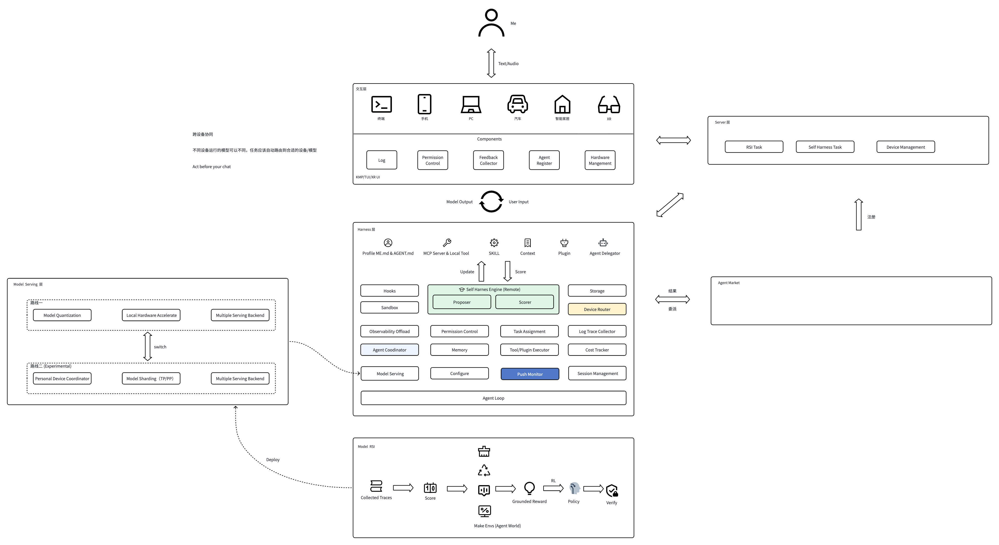

# OpenAICompanion

OpenAICompanion 是一个面向个人设备、以本地数据为中心的 AI 助手实验项目。它使用 Rust Harness 运行 Agent Loop、保存会话轨迹与记忆，并通过 Kotlin Multiplatform（KMP）和 UniFFI 连接应用端。项目仍处于 MVP 开发阶段；架构图中的部分能力尚未实现。

## 当前状态

| 平台 | 实现 | 状态 |
| --- | --- | --- |
| macOS | Compose Desktop（KMP/JVM）+ Rust Harness | MVP 已实现，可在 macOS 本机构建运行 |
| iOS | KMP + Compose Multiplatform + Kotlin/Native Rust 绑定 + llama.cpp | 不使用 Swift；模拟器与真机 App 均已完成无签名构建，模拟器会话、本地推理和本机 MCP 连接 UI 测试已通过 |
| Android | KMP + Compose Multiplatform + Rust UniFFI + llama.cpp JNI | Debug APK 已构建；Android 35 ARM64 模拟器已验证安装、首屏启动与本地存储初始化 |

macOS 与 iOS 现在使用同一条持续对话轨迹，不提供新建会话入口。Rust Harness 每轮读取最多 8 轮原始 trace、紧邻窗口的一条 4 轮对话摘要、按当前问题匹配的一条更早摘要，以及已有的长期画像记录；成功完成的 Turn 会异步提取中长期记忆点。macOS 端支持配置远程 MCP 服务；iOS 的 KMP 共享 MCP 客户端已通过 JVM 协议测试，Compose、OAuth、Rust 桥接与端侧模型已接入 Xcode target，模拟器与真机 App 已完成无签名构建；模拟器上 3 项 UI 测试通过，真机端到端验收仍待完成。

## 生产基础进展

已接入统一 ASGI 服务、HTTPS 容器部署配置、可撤销凭据与一次性配对、提交回执恢复、版本迁移、离线备份/导出/删除及 CI。Mac 提供常驻自动接单 worker；手机固定提醒交给系统排程。端侧工具默认关闭，作为可选扩展开启。部署、数据维护和执行边界见[跨设备执行指南](docs/cross_device_execution.md)与[主动任务指南](docs/proactive.md)。

目前仍不能作为完成生产验收的版本：Android 编译和真机后台验收、正式签名发布、生产部署/恢复演练、全链路磁盘与备份加密、App 内数据管理、真实模型质量评测、容量/保留策略和运维告警尚待完成。手机退出后的实时条件推理与远程结果推送也未接入；系统计划提醒不包含实时判断。2026-10-07 已进一步完成 Mac 打包 worker 实际接单回传、三库恢复及 iOS 模拟器 UI/退出后系统提醒验收；逐项结果和仍未验收的边界见[本机验收记录](docs/cross_device_execution.md#2026-10-07-本机验收记录)。

## 快速开始

### macOS

需要 macOS、JDK 21、Rust 工具链，以及一个 OpenAI 兼容的 Chat Completions 模型服务。首次构建还需要下载 Gradle、Kotlin 和 Rust 依赖。从仓库根目录运行：

```bash
./scripts/macos-app.sh run
```

应用默认使用本机 Ollama 地址 `http://localhost:11434/v1/chat/completions`，模型名为 `hf.co/unsloth/Qwen3.8-27B-GGUF:UD-Q4_K_M`。模型需自行安装，也可在应用设置中改用其他兼容服务。打包 DMG：

```bash
./scripts/macos-app.sh package
```

安装模型、运行参数和数据目录详见 [macOS MVP 指南](docs/macos_mvp.md)。

### iOS

需要完整 Xcode（含 iOS SDK）、JDK 21 和 Rust iOS 目标。当前 Xcode target 使用 Objective-C 启动壳、KMP + Compose Multiplatform 界面，不使用 Swift：

```bash
rustup target add aarch64-apple-ios aarch64-apple-ios-sim
./scripts/ios-llama.sh
open ios/OpenAICompanion.xcodeproj
```

安装完整 Xcode 后，可运行 `./scripts/ios-app-check.sh` 构建 iOS 模拟器 App，检查 KMP、Rust、llama.cpp 与 Xcode 工程的链接。

iOS 使用 llama.cpp 在设备本机运行用户导入的 GGUF；不依赖 Mac 的 Ollama 服务，也不内置桌面端的 27B 模型。构建 llama.cpp 需要 CMake 3.28+。当前 iOS 工程已通过完整 Xcode App 构建和模拟器启动，模型及真机验收状态见 [iOS MVP 指南](docs/ios_mvp.md)。

### Android

Android App 已完成 Debug APK 构建及 Android 35 ARM64 模拟器启动烟测。构建依赖 Android SDK、NDK、Rust Android 目标以及仓库内的 llama.cpp 源码。构建命令、复用范围与尚未验收的功能见 [Android MVP 指南](docs/android_mvp.md)。

## 架构

- `harness/`：Rust Agent Loop、模型与工具回调接口、SQLite 记忆及会话轨迹。
- `kmp/`：跨平台数据模型、Compose 界面、共享 MCP/A2A 客户端、Android/macOS UniFFI JVM 绑定，以及 iOS Kotlin/Native Rust 绑定。
- `ios/`：Objective-C 启动壳与 Objective-C++ llama.cpp 适配；界面和业务逻辑位于 `kmp/`。
- `scripts/`：绑定生成及平台构建脚本。



上图描述产品愿景，不代表所有模块已在当前 MVP 中实现。已落地能力以代码和各平台指南为准。

## 测试

Rust Harness：

```bash
cargo test --manifest-path harness/Cargo.toml
```

KMP/JVM 桥接测试需要先构建 Rust 动态库：

```bash
cargo build --manifest-path harness/Cargo.toml --release
cd kmp
HARNESS_LIBRARY_PATH="$PWD/../harness/target/release/libharness.dylib" \
  ./gradlew -PkmpJvmToolchain=21 jvmTest
```

iOS 的 KMP 核心代码可在 `kmp/` 下用 `./gradlew -PkmpJvmToolchain=21 :compileKotlinIosSimulatorArm64` 单独编译；这不等同于 Rust 绑定 C interop、iOS App 的链接或运行验收。
工具调用历史到 GGUF 提示词的本地转换测试可运行 `./scripts/test-ios-prompt.sh`。
用于 iOS 模拟器手动验收的本机 MCP 服务及步骤见 [iOS MVP 指南](docs/ios_mvp.md)。

## 数据与安全

会话轨迹和记忆保存在应用本地 SQLite 中，目前**没有数据库加密**。macOS 模型请求会发送到设置的服务地址；iOS 的 GGUF 推理在设备本机进行。两端各自保存本地数据，尚无跨设备会话同步。不要将未认证的 Ollama HTTP 服务直接暴露到公网。处理敏感个人数据前，请先评估存储加密、模型服务权限与网络配置。

## 文档

- [Agent Loop 设计](docs/agent_loop_core.md)
- [三层记忆实现](docs/memory.md)
- [通用主动任务与通知](docs/proactive.md)
- [本地会话轨迹](docs/session_trace.md)
- [macOS MVP](docs/macos_mvp.md)
- [iOS MVP](docs/ios_mvp.md)
- [Android MVP](docs/android_mvp.md)
- [跨端记忆同步](docs/memory_sync.md)
- [跨设备任务路由与 A2A 执行](docs/cross_device_execution.md)
- [统一端侧工具：设备上下文、日程查询与新建](docs/device_calendar_tool.md)

## 反馈与贡献

构建或使用时遇到问题，可在仓库 Issue 中提供操作系统、Xcode/JDK/Rust 版本、复现步骤和相关日志。欢迎围绕各平台指南中的运行边界和待验收能力提交讨论或 Pull Request；提交代码前请运行受影响模块的测试。

## 许可证

本项目采用 [Apache License 2.0](LICENSE)。
