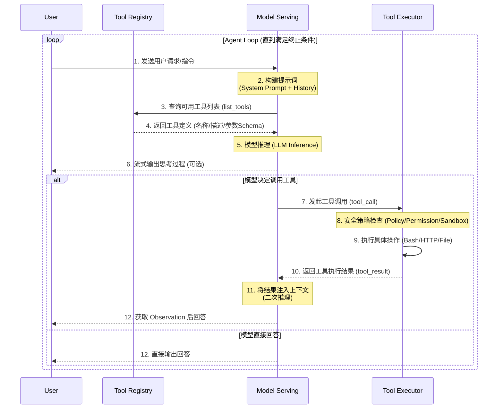

# Agent Loop
Agent Loop 核心是 tool use 循环控制，围绕着 tool use 会增加诸如 hooks、sandbox、权限管理、工具注册机制等模块，但抽丝剥茧，核心逻辑如下时序图所示：

```mermaid
sequenceDiagram
    participant User
    participant ToolRegistry as Tool Registry
    participant ModelServing as Model Serving
    participant ToolExecutor as Tool Executor

    loop Agent Loop (直到满足终止条件)
        User->>ModelServing: 1. 发送用户请求/指令
        Note over ModelServing: 2. 构建提示词<br/>(System Prompt + History)
        ModelServing->>ToolRegistry: 3. 查询可用工具列表 (list_tools)
        ToolRegistry-->>ModelServing: 4. 返回工具定义 (名称/描述/参数Schema)
        Note over ModelServing: 5. 模型推理 (LLM Inference)
        ModelServing-->>User: 6. 流式输出思考过程 (可选)
        alt 模型决定调用工具
            ModelServing->>ToolExecutor: 7. 发起工具调用 (tool_call)
            Note over ToolExecutor: 8. 安全策略检查 (Policy/Permission/Sandbox)
            ToolExecutor->>ToolExecutor: 9. 执行具体操作 (Bash/HTTP/File)
            ToolExecutor-->>ModelServing: 10. 返回工具执行结果 (tool_result)
            Note over ModelServing: 11. 将结果注入上下文<br/>(二次推理)
            ModelServing-->>User: 12. 获取 Observation 后回答
        else 模型直接回答
            ModelServing-->>User: 12. 直接输出回答
        end
    end
```