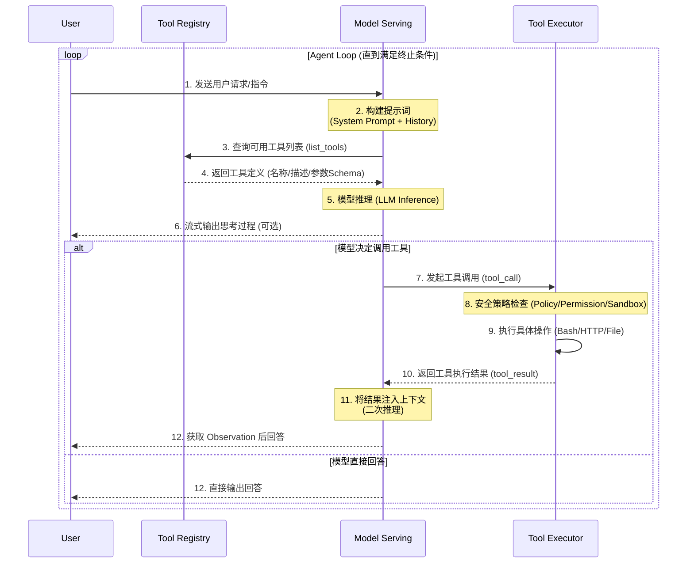
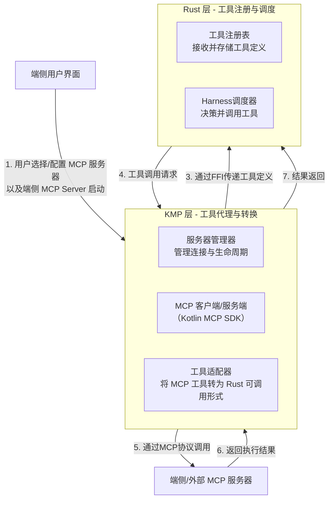

# Agent Loop
Agent Loop 核心是 tool use 循环控制，围绕着 tool use 会增加诸如 hooks、sandbox、权限管理、工具注册机制等模块，但抽丝剥茧，核心逻辑如下时序图所示：

## Tool Registry

> MCP 工具、多端工具注册、内置工具
>
> 

工具是动作的载体，扩展了 harness 行动的上限，个人数字分身的工具分为两种类型，一种是内置工具，常驻于 harness 生命周期中，另一种是外置工具，如各类 MCP server 等，按需加载。

### 初始化

Harness 初始化时，会在端侧内存中维护一个 Tool Registry 实例，将所有内置工具和外置工具 schema 注册进实例中，但由于端侧推理上下文比较紧俏，模型上下文不会一次性载入工具注册中所有的工具，而是采用渐进式披露的策略，通过内置工具 **load\_more\_tools **由 agent 主动加载 tool registry 中已注册工具，由 `num_tool_per_load` 控制每次加载多少个工具。

### 内置工具

| 工具名称          | 工具定义 | 实现逻辑 |
| ----------------- | -------- | -------- |
| load\_more\_tools |          | 见附录   |
| web\_search       |          |          |

- load\_more\_tools

### 外置工具

外置工具主要由 MCP 协议实现，分为 **Remote Server 工具**和**端侧专用工具**，首先来看 MCP 工具如何接入：

**MCP 工具接入流程**

**Remote Server 工具**

端侧 UI 层：用户通过配置页面配置 server 地址和 headers，详细设计见 UI 设计章节。

KMP 层：依赖 `modelcontextprotocol/kotlin-sdk` 实现

- MCP Server 生命周期：负责服务器的初始化、连接、断开、重试等功能；

- MCP Client：主要实现 `client.listTools() `获取服务器工具定义；

- 工具适配：在 KMP 层抽象定义一个 `expect`类或接口，在端侧 UI 层提供具体的 `actual` 实现，实现中调用`client.callTool()` 方法，将请求通过 http sse 发送给远程 MCP 服务器。

- 工具定义传递：将从MCP服务器获取的工具列表（名称、描述、参数Schema），通过 FFI（如UniFFI）传递给Rust层。

Harness 层：

- 工具注册：在 MCP Server 建立连接时，`client.listTools()`将远程 MCP Server 的工具通过 UniFFI 传输注册到内存中的 Tool Registry；

- 工具调度：当模型决定调用某个工具时，Harness 的调度器会通过之前注册的适配器，将调用请求通过 FFI 转发回 KMP 层。

**端侧专用工具**

与 Remote Server 工具不同，端侧专用工具旨在发挥各端特有优势，比如手机传感器、摄像头，各操作系统生态 APP 等，丰富个人助理的工具种类。主要思路是各端通过 KMP 层实现多个 MCP Server，在 server 中**增量式**实现不同工具，维护在下方表格中，通过 stdio 与 KMP 层的 MCP Client 进行通信，并通过 UniFFI 与 Harness 进行交互，即注册和调度。端侧专用工具是一个增量功能需要开发者主动实现新增工具，核心逻辑是在 KMP MCP Server 层中实现。

| 终端                | 工具名      | 工具描述 | 实现路基    |
| ------------------- | ----------- | -------- | ----------- |
| 手机（iOS/Android） | get\_events | 查询日程 | 见附录 1\.x |
